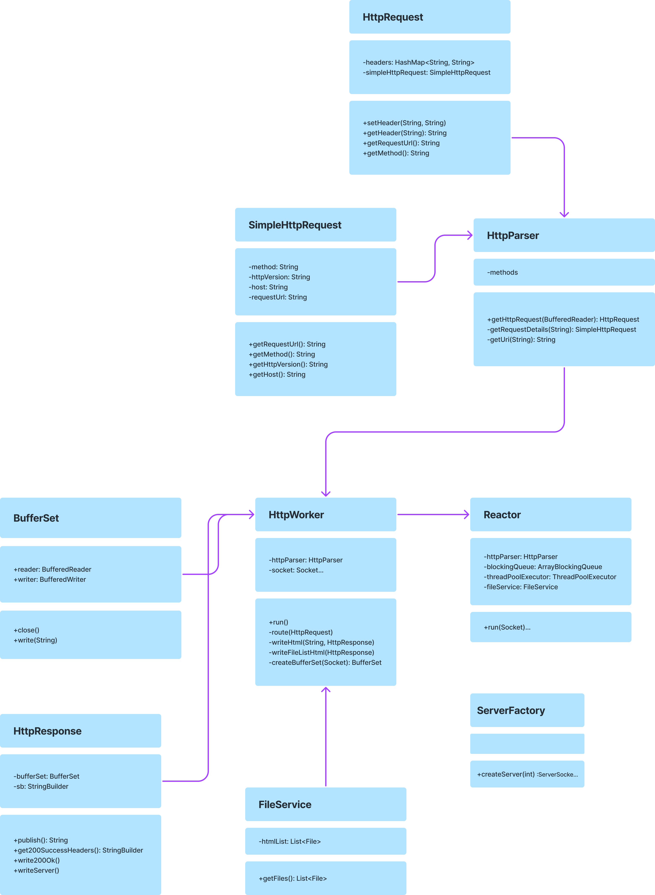

# EUNCAT

학습 목적으로 작성된 자바로 작성된 멀티스레드 웹 서버
* 서버 내부에 저장된 정적 웹 자원(HTML) 파일 리스트 자동 생성 및 전달
* 스레드 단위 클라이언트 요청 처리
* TCP 레벨에서 HTTP 요청 처리

## Goals
* UML 구조 이해 및 작성
* 자바 언어 숙련도 향상
* 스레드 생성 및 관리

# Details
### UML

